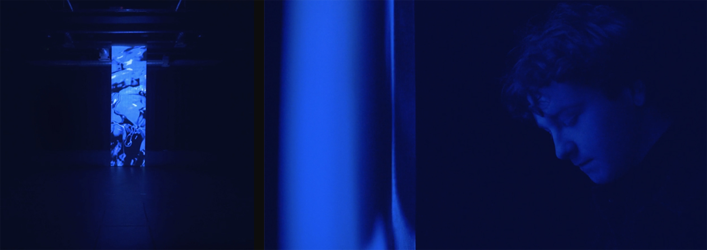

# Herma

Videos and project details please check [PROJECT PAGE HERE](https://bingcomputing.hotglue.me/?herma)

-

2019

Interactive installation

Credit: Creative technologist/ Programmer

#OpenFrameworks #Kinect

-

Collaborated with art director [Louisiane Trotobas](https://louisianetrotobas.com/), [HERMA](https://herma.space/more.html) is an interactive installation that re-imagines gender using light, sound, and scent. Through abstraction, the multi-sensory experience strives to de-construct the normative idea of gender representations and expectations. Gender expressions extend beyond the categorical conventions of masculinity, femininity, and androgyny. By creating unexpected encounters with perpetually moving textures and forms, HERMA explores gender’s ambiguous and shape-shifting nature.
